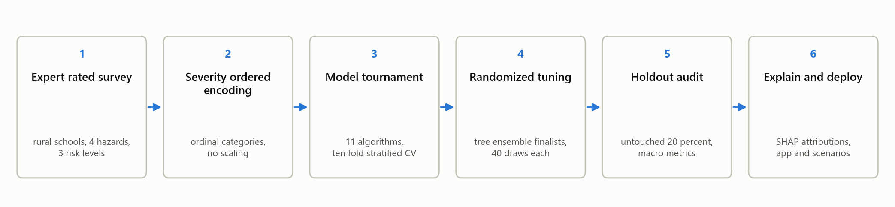
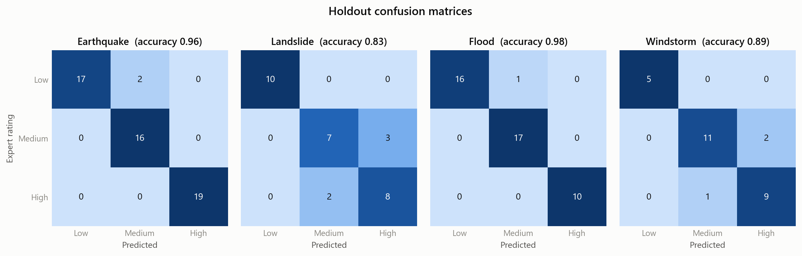
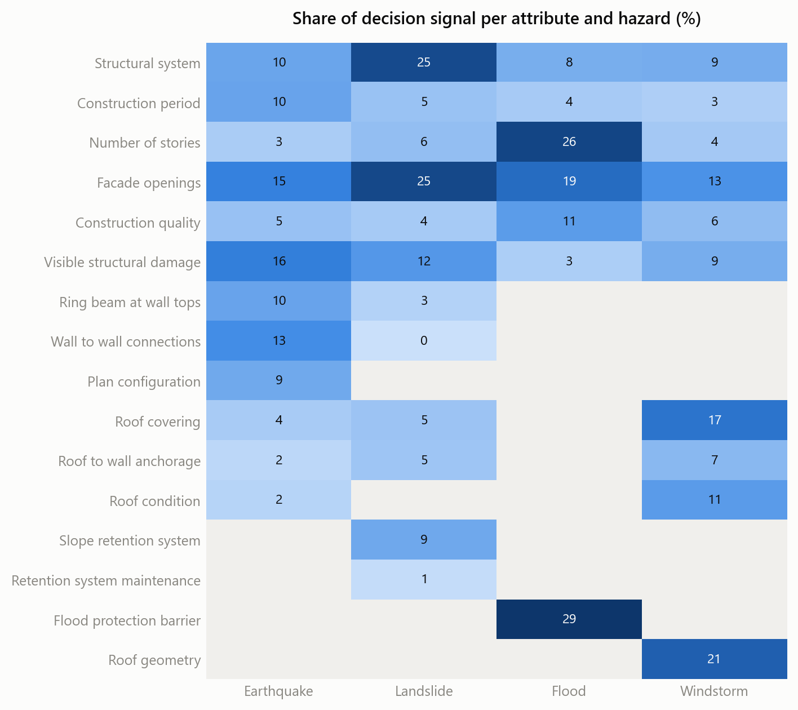
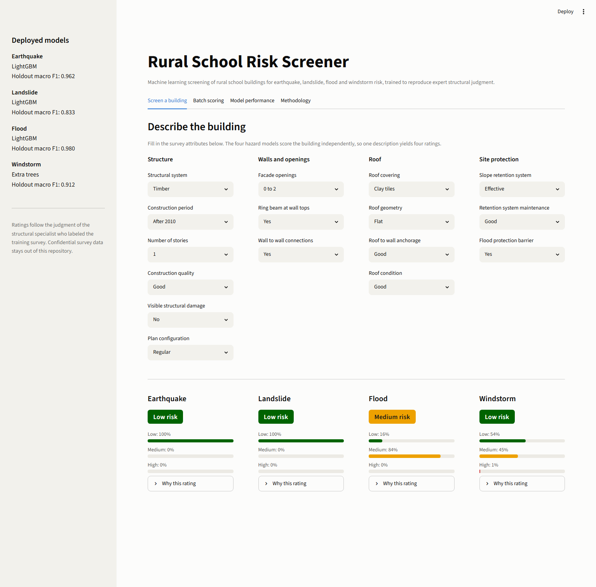
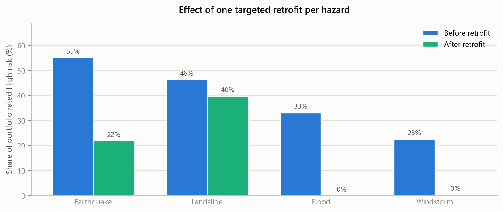

# Multihazard Risk Screening of Rural Schools with Interpretable Machine Learning


Rural school buildings in Colombia were surveyed in the field and a structural
specialist rated every building for four natural hazards: **earthquake,
landslide, flood and windstorm**, using three risk levels, Low, Medium and
High. This project trains machine learning models that reproduce that expert
judgment from the survey attributes alone, proves with SHAP that they reason
like the specialist, and deploys them as a screening application and a
scenario engine for retrofit planning.



## Results

One classifier per hazard, selected from an eleven algorithm tournament under
ten fold stratified cross validation and randomized tuning, then audited once
on an untouched twenty percent holdout.

| Hazard | Records | Deployed model | CV macro F1 | Holdout accuracy | Holdout macro F1 | ROC AUC |
|--------|---------|----------------|-------------|------------------|------------------|---------|
| Earthquake | 266 | LightGBM | 0.966 | 0.963 | 0.962 | 0.999 |
| Landslide | 150 | LightGBM | 0.938 | 0.833 | 0.833 | 0.953 |
| Flood | 216 | LightGBM | 0.963 | 0.977 | 0.980 | 1.000 |
| Windstorm | 137 | Extra Trees | 0.916 | 0.893 | 0.912 | 0.989 |

Holdout partitions are small, 28 to 54 records, so the cross validated score
is the primary evidence and the holdout serves as a final audit. The audit has
one property that matters more than the averages: **every single
misclassification is an adjacent class confusion**. No Low building is ever
called High and no High building is ever called Low, for any hazard.



## The models reason like the specialist

SHAP decomposes every prediction into per attribute contributions. Aggregated
over the holdout, the decision signal of each model concentrates exactly where
the physics of each failure mechanism says it should: connections and existing
damage for earthquake, site retention and configuration for landslide, the
protective barrier and vertical exposure for flood, and the roof envelope for
windstorm.



Notebook three drills into each hazard with per class stacked contributions
and beeswarm views of every holdout building.

## The screening application

A Streamlit application wraps the four pipelines. Describe a building once and
receive four independent ratings with class probabilities and a per building
SHAP explanation of every rating. A second tab scores whole portfolios from a
CSV file, validates them against the schema, and returns the predictions with
class probabilities.



```
streamlit run app/app.py
```

## Scenario studies

Because the models emulate the specialist at negligible cost, they can score
thousands of hypothetical buildings. Notebook four generates plausible
configurations under realism constraints, maps the risk landscape, and
quantifies targeted retrofit campaigns. One intervention per hazard, chosen
from the SHAP profiles, collapses the High risk share of the synthetic
portfolio:



## Repository tour

```
rural-school-risk-ml/
    app/                  Streamlit screening application
    data/
        demo/             synthetic, model labeled datasets (versioned)
        private/          real survey (local only, never versioned)
    models/               fitted pipelines and model cards, one per hazard
    notebooks/
        01_data_overview.ipynb                 schema, sanitation, distributions
        02_model_training_and_selection.ipynb  tournament, tuning, holdout audit
        03_model_interpretability_shap.ipynb   global and local explanations
        04_scenario_simulation.ipynb           portfolio screening, retrofits
    reports/
        figures/          every figure in this README and more
        metrics/          comparison tables, holdout reports, SHAP tables
    scripts/
        train_models.py           end to end training for every hazard
        generate_demo_data.py     rebuild the demo tier from the models
        make_pipeline_diagram.py  the overview figure
    src/schoolrisk/       config, data, modeling, explain, simulate, plots
    tests/                schema, data, simulation, pipeline and model tests
```

## Quickstart

```
git clone https://github.com/Alexey0424/rural-school-risk-ml.git
cd rural-school-risk-ml
pip install -e .[dev,app]
pytest                              # 43 tests, runs on the demo tier
python scripts/train_models.py      # retrain everything end to end
streamlit run app/app.py            # launch the screener
```

Everything runs without the confidential survey: the loader falls back to the
versioned demo tier automatically (see `data/README.md`).

## Method in six steps

1. **Expert rated survey.** Field records of rural school buildings, one
   rating per hazard per building. Classes were balanced with expert
   validated synthetic cases during the original study.
2. **Severity ordered encoding.** Every attribute is categorical with an
   expert defined ordering from favorable to unfavorable, encoded ordinally.
   The orderings are hazard specific: a single story building is favorable
   under earthquake and exposed under flood.
3. **Sanitation.** Exact duplicate records are removed before splitting so
   the holdout cannot be memorized. The split is stratified with a fixed
   seed.
4. **Tournament and tuning.** Eleven algorithms compared with ten fold
   stratified cross validation on six metrics; the strongest tree ensembles
   receive a forty draw randomized search. Tree ensembles are the deployment
   family because they ship exact SHAP attributions.
5. **Single holdout audit.** The winner sees the holdout once. Macro metrics
   anchor the evaluation because the windstorm classes are imbalanced.
6. **Explain and deploy.** Global and per building SHAP, model cards with
   schema and metrics next to each pickle, a screening app and a scenario
   engine.

## Data confidentiality

The survey belongs to a research project and is not distributed. The
repository enforces that boundary by construction:

* the private tier lives in `data/private/`, which is excluded by
  `.gitignore`, and the loader treats it as an optional local resource,
* attribute names and category labels in the public schema are paraphrased
  relative to the original study instruments,
* published notebooks show aggregate views and a single five row glimpse,
* the versioned demo datasets are synthetic and labeled by the trained
  models, never by the confidential rating methodology.

The models are screening aids for prioritization. They do not replace a
structural evaluation by a qualified professional.

## Author

Alexey David Velasquez Betancurt. The project builds on a university research
collaboration on school infrastructure risk in Colombia; the field survey and
the original rating methodology remain confidential to that project.

## License

MIT, see `LICENSE`.
